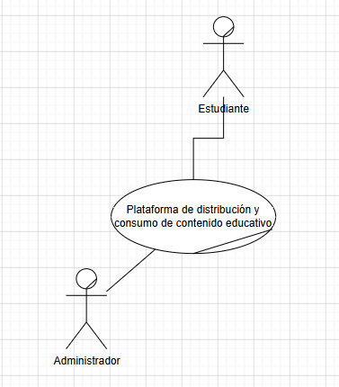
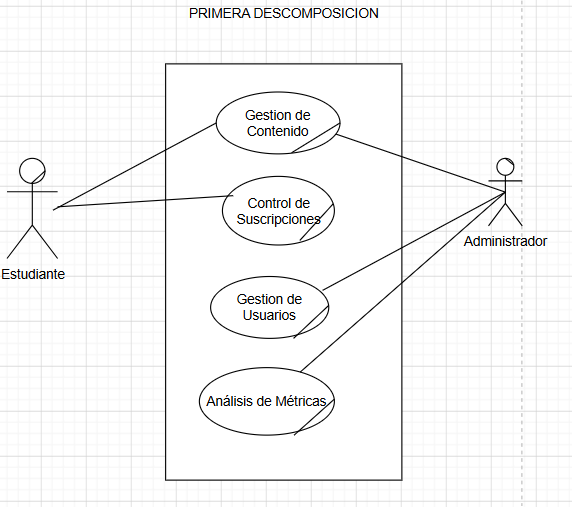
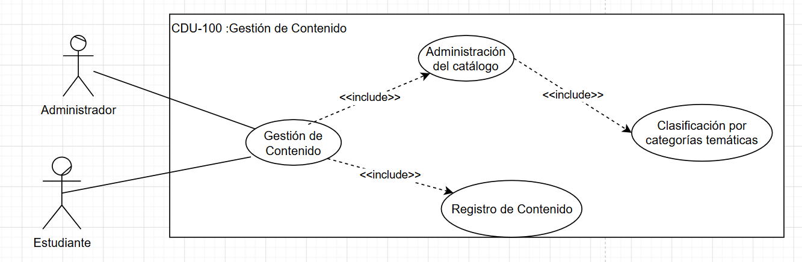
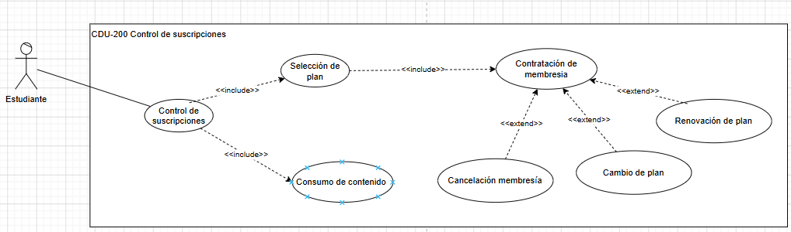
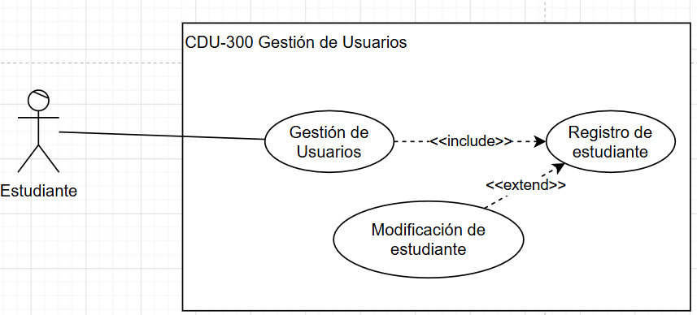
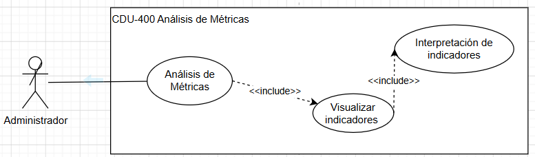
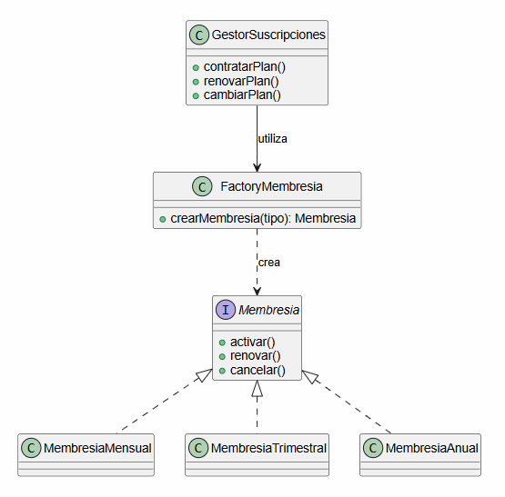

# Análisis y Diseño de Sistemas 2
## Universidad de San Carlos de Guatemala
### Facultad de Ingeniería — Ingeniería en Ciencias y Sistemas

---

# Práctica Única: LearnFlow
## Documento de Decisión de Arquitectura (DDA)

### Plataforma de Aprendizaje en Línea

---

## Integrantes

| # | Nombre completo | Carnet |
|---|-----------------|---------|
| 1 | Luis Pablo Manuel García López | 202200129 |
| 2 | Harold Alejandro Sánchez Hernández | 202200100 |
| 3 | Madeline Fabiola Prado Reyes | 202100039 |
| 4 | Jeysson Ezequiel Godoy Torres | 3429393512210 |
| 5 | Kenneth Isaí Aquino Ortiz | 202100678 |
| 6 | Diego Andrés Aguilar Díaz | 2734901842001 |
| 7 | Kevin Golwer Enrique Ruiz Barbales | 201603009 |

---

# Índice

1. Introducción
2. Core del Negocio
3. Drivers Arquitectónicos
4. Justificación Arquitectónica
5. Conclusiones

---

# 1. Introducción

## 1.1 Objetivo
El presente Documento de Decisión de Arquitectura (DDA) tiene como objetivo documentar las decisiones arquitectónicas adoptadas para el desarrollo de LearnFlow, una plataforma de aprendizaje en línea orientada a la distribución y consumo de contenido educativo mediante un modelo de suscripciones. En este documento se presenta el core del negocio, los casos de uso expandidos, los drivers arquitectónicos y la justificación del framework y del patrón de diseño seleccionados, proporcionando el sustento técnico de la solución propuesta.
---

## 1.2 Alcance
El presente documento abarca el diseño arquitectónico de la plataforma LearnFlow, incluyendo el análisis del negocio, la definición del core del sistema, los casos de uso principales, los requerimientos funcionales y los atributos de calidad considerados durante el desarrollo. Asimismo, documenta la justificación de las decisiones tecnológicas relacionadas con el framework de desarrollo y el patrón de diseño implementado para garantizar una solución modular, mantenible y alineada con los requerimientos establecidos.
---

# 2. Core del Negocio

## 2.1 Descripción

El core del negocio de LearnFlow consiste en gestionar la distribución y el consumo de contenido educativo mediante un modelo de suscripciones, permitiendo a los estudiantes acceder a cursos, talleres y conferencias, mientras que el administrador mantiene actualizado el catálogo de contenido y monitorea el comportamiento de la plataforma.
---

## 2.2 Core del Negocio

Gestionar la distribución y el consumo de contenido educativo mediante un modelo de suscripciones.

### Explicación

El Core del Negocio representa la actividad principal de LearnFlow, enfocada en la distribución y el consumo de contenido educativo mediante un modelo de suscripciones. A partir de este proceso principal se derivan los procesos de gestión de usuarios, control de suscripciones, gestión de contenido y Analisis de métricas.

---

## 2.3 Primera Descomposición

### Explicación
La primera descomposición del Core del Negocio identifica los principales procesos que conforman la operación de LearnFlow. Cada proceso agrupa las funcionalidades necesarias para atender las responsabilidades de los actores del sistema y organizar las capacidades del negocio.

- **Gestión de Usuarios:** permite el registro, autenticación y actualización de la información de los estudiantes, garantizando una administración adecuada de sus datos y credenciales.

- **Gestión de Contenido:** comprende la administración del catálogo de contenido educativo, incluyendo tipos de contenido, categorías temáticas, niveles de dificultad y cursos disponibles en la plataforma.

- **Control de Suscripciones:** administra el ciclo de vida de las membresías, permitiendo la contratación, renovación, cancelación y validación de los planes necesarios para acceder al contenido educativo.

- **Análisis de Métricas:** proporciona al administrador información estadística sobre el uso de la plataforma mediante indicadores y gráficas que apoyan la toma de decisiones.

---

# 2.4 Casos de Uso Expandidos
## CDU-100

## CDU-200

## CDU-300

## CDU-400

---

# 3. Drivers Arquitectónicos

 ## 3.1 Drivers Funcionales

| Código | Descripción                               |
| ------ | ----------------------------------------- |
| RF-01  | Registro de estudiantes                   |
| RF-02  | Validación de correo electrónico único    |
| RF-03  | Inicio de sesión                          |
| RF-04  | Cambio de contraseña                      |
| RF-05  | Validación de roles de acceso             |
| RF-06  | Contratación de membresía                 |
| RF-07  | Cambio de plan de suscripción             |
| RF-08  | Renovación de membresía                   |
| RF-09  | Cancelación de membresía                  |
| RF-10  | Control de acceso mediante membresía      |
| RF-11  | Búsqueda de contenido educativo           |
| RF-12  | Reproducción de contenido                 |
| RF-13  | Registro de bitácora de visualización     |
| RF-14  | Recomendación basada en preferencias      |
| RF-15  | Visualización de contenido popular        |
| RF-16  | Visualización del progreso de aprendizaje |
| RF-17  | Gestión de contenido educativo            |
| RF-18  | Administración de recursos educativos     |
| RF-19  | Visuaización de métricas                  |

---
## 3.2 Drivers No Funcionales (EaC)

| Código | Categoría | Escenario |
|---------|-----------|-----------|
| EaC-01 | Confidencialidad | El sistema debe proteger la información sensible de los estudiantes, como contraseñas y datos de pago, mediante mecanismos de cifrado y almacenamiento seguro. |
| EaC-02 | Seguridad | El sistema debe autenticar a los usuarios y restringir el acceso a las funcionalidades según el rol asignado (Estudiante o Administrador). |
| EaC-03 | Integridad | El sistema debe garantizar que cada correo electrónico registrado sea único para evitar la duplicidad de cuentas. |
| EaC-04 | Usabilidad | La interfaz debe permitir que estudiantes y administradores realicen sus actividades de forma intuitiva, facilitando la navegación y el acceso a las funcionalidades de la plataforma. |
| EaC-05 | Mantenibilidad | La solución debe desarrollarse con una arquitectura modular y aplicando principios SOLID para facilitar futuras modificaciones, mantenimiento y escalabilidad del sistema. |
| EaC-06 | Disponibilidad | La plataforma debe mantener una disponibilidad mínima del 99%, garantizando el acceso continuo a los servicios de aprendizaje y administración. |
---
## 3.3 Drivers de Restricción

| Código | Restricción | Justificación |
|---------|-------------|---------------|
| R-01 | La solución debe desarrollarse como una aplicación web. | La plataforma debe ser accesible mediante un navegador web para estudiantes y administradores. |
| R-02 | La autenticación debe realizarse mediante correo electrónico y contraseña. | El enunciado establece este mecanismo de acceso para ambos perfiles. |
| R-03 | El correo electrónico debe ser único dentro del sistema. | Garantiza la identificación única de cada estudiante y evita cuentas duplicadas. |
| R-04 | El acceso al contenido requiere una membresía activa. | Solo los estudiantes con una suscripción vigente pueden consumir contenido educativo. |
| R-05 | El estudiante debe registrar un método de pago para contratar o renovar una membresía. | La contratación y renovación de los planes requieren un método de pago asociado. |
| R-06 | El dashboard administrativo debe mostrar los indicadores mediante gráficas. | El administrador debe visualizar la información estadística de forma gráfica para analizar el comportamiento de la plataforma. |
---
# 4. Justificación Arquitectónica

## 4.1 Framework Seleccionado

### Framework

**Spring Boot**

### Justificación

Se seleccionó **Spring Boot** como framework para el desarrollo del backend de LearnFlow debido a que proporciona una estructura robusta para construir aplicaciones web basadas en Java. Su arquitectura por capas facilita la separación entre la presentación, la lógica de negocio y el acceso a datos, permitiendo desarrollar una solución organizada, mantenible y escalable.

Además, Spring Boot simplifica la creación de servicios REST, la integración con bases de datos mediante Spring Data JPA y la implementación de mecanismos de autenticación y autorización, funcionalidades necesarias para la administración de estudiantes, contenido educativo, suscripciones y métricas de la plataforma.

### Ventajas

* Desarrollo rápido de aplicaciones web y APIs REST.
* Integración sencilla con Spring Data JPA para el acceso a datos.
* Implementación de inyección de dependencias mediante Spring IoC.
* Arquitectura modular que facilita el mantenimiento del sistema.
* Amplio soporte de documentación y comunidad.

### Desventajas

* Mayor consumo de memoria en comparación con frameworks más ligeros.
* Requiere conocimientos del ecosistema Spring para aprovechar todas sus funcionalidades.
* Puede resultar complejo para aplicaciones pequeñas.

### Relación con LearnFlow

Spring Boot permite implementar de forma organizada los principales módulos de LearnFlow, tales como el registro de estudiantes, autenticación, administración del contenido educativo, control de suscripciones, reproducción de contenido y análisis de métricas. Su arquitectura facilita la incorporación de nuevas funcionalidades sin afectar significativamente los módulos existentes, favoreciendo la mantenibilidad y escalabilidad de la plataforma.

---

## 4.2 Patrón de Diseño

### Patrón Seleccionado

**Factory Method**

### Problema que Resuelve

LearnFlow administra diferentes tipos de membresía para el acceso al contenido educativo, como planes mensuales, trimestrales y anuales. Cada tipo de plan posee características particulares relacionadas con su duración y vigencia. Si la creación de estas membresías se realiza directamente dentro de la lógica de negocio, el sistema aumenta su acoplamiento y dificulta futuras ampliaciones.

### Justificación

Se seleccionó el patrón **Factory Method** porque permite encapsular la creación de los diferentes tipos de membresía dentro de una fábrica especializada. De esta manera, la lógica de negocio únicamente solicita el tipo de plan requerido sin depender de clases concretas.

Esta solución facilita la incorporación de nuevos tipos de membresía en el futuro sin modificar la lógica principal del sistema, favoreciendo el cumplimiento del principio Open/Closed.

### Beneficios

* Reduce el acoplamiento entre la lógica de negocio y las clases concretas.
* Facilita la incorporación de nuevos tipos de membresía.
* Centraliza la creación de objetos relacionados con las suscripciones.
* Mejora la organización y mantenibilidad del código.
* Favorece la extensibilidad del sistema.

### Diagrama UML

### Implementación

El patrón Factory Method se implementa en el módulo de suscripciones. Una fábrica se encarga de crear la instancia correspondiente según el plan seleccionado por el estudiante (Mensual, Trimestral o Anual). Cada tipo de membresía implementa su comportamiento específico, mientras que la lógica principal permanece desacoplada del proceso de creación, facilitando futuras ampliaciones de la plataforma.

# 5. Dailys   

## Luis Pablo Manuel García López

Durante el primer día dejé listo el repositorio privado en GitHub y
configuré las ramas main y develop. Después preparé el proyecto con
Spring Boot, organicé la estructura base del backend, configuré la
conexión con la base de datos y creé las entidades iniciales Student,
User y Role.

## Harold Alejandro Sánchez Hernández

Comencé trabajando en el módulo de autenticación de estudiantes. Avancé
con el registro de usuarios, preparé la validación para que no se
repitan correos electrónicos y dejé iniciada la lógica del inicio de
sesión junto con los campos principales del perfil.

## Madeline Fabiola Prado Reyes

Mi trabajo del primer día estuvo enfocado en planificar el sistema de
suscripciones. Inicié la implementación de los planes disponibles y
estructuré la aplicación del patrón Factory Method para la creación de
las membresías.

## Jeysson Ezequiel Godoy Torres

Inicié desarrollando la base para la gestión del contenido educativo.
Dejé preparada la estructura de los CRUD para tipos de contenido,
categorías y niveles de dificultad, además de definir la información
principal que tendrá cada curso.

## Kenneth Isaí Aquino Ortiz

La jornada comenzó con la implementación del módulo de reproducción de
contenido. También preparé la validación de acceso para estudiantes con
suscripción activa y definí la estructura que almacenará el historial y
las futuras recomendaciones.

## Diego Andrés Aguilar Díaz

Aproveché el primer día para avanzar con las pantallas principales del
frontend. Quedaron iniciadas las vistas de inicio de sesión y registro,
además de la estructura del perfil, suscripciones y la conexión inicial
con el backend.

## Kevin Golwer Enrique Ruiz Barbales

El enfoque del primer día fue organizar el dashboard administrativo.
Definí las métricas que deberá mostrar, revisé la documentación del
proyecto y empecé a verificar que la estructura del repositorio
cumpliera con los requisitos de la entrega.

# 6. Conclusiones

## Conclusión 1

El análisis del negocio permitió identificar el proceso principal de LearnFlow y descomponerlo en los módulos de gestión de usuarios, gestión de contenido, control de suscripciones y análisis de métricas, facilitando una arquitectura organizada y alineada con las necesidades de la plataforma.

---

## Conclusión 2

La identificación de los drivers funcionales, atributos de calidad y restricciones permitió justificar las decisiones arquitectónicas adoptadas, garantizando que la solución responda a los requerimientos del negocio y facilite el desarrollo de una plataforma mantenible y escalable.

---

## Conclusión 3

La selección de Spring Boot como framework y del patrón de diseño Factory Method proporciona una base sólida para el desarrollo de LearnFlow, permitiendo una implementación modular, organizada y preparada para incorporar nuevos tipos de membresía y futuras funcionalidades sin afectar significativamente la estructura del sistema.
